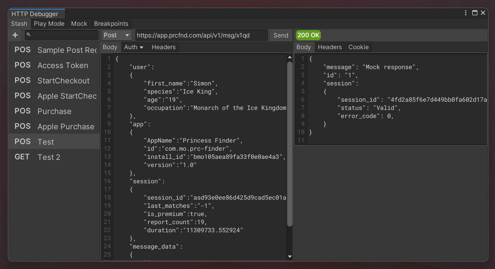

# Unity HTTP Debugger

Http request logging tool for Unity. 

- Send http requests from Editor Window
  - Save requests and responses
- Log http requests
 
# TODO
## Problems
- I can't extract request headers from `UnityWebRequest` object

## Features
- Runtime API
    - Process Request API
    - Integrate UniTask?
    - If you’re using the HttpClient class another option is to pass a custom message handler to it’s constructor

- Editor
    - Serialize data outside EditorPrefs, so that two different project dont share the same data

- Request View
    - Edit Headers
    - Edit Authentication
    - "Format" Button for json body

- Response View
    - Raw/Formatted payload toggle
    - XML Response formatter

- Playmode Tab
    - Change list view to Tree view with columns for name, url, response, method, time [example](https://dotnetanalysis.blogspot.com/2012/11/http-status-codes-tutorial.html)
    - request breakpoints (edit request before it is sent)
    - Add "Clear on Play" toggle
    - Autoscroll down
    - Add stacktrace
        - Double-click to open script
    - Add filters
        - Ability to toggle log visibility by ID
    - Categories
        - Add req IDs to categories and filter logs by them
    - ~~Right click request to "Save to stash"~~     

- Mock Tab
    - request mock values (with enable toggles

- Breakpoint Tab

- QoL
    - If reqest url doesn't start with https or http try to add it
    - Fix performance issue when Playmode has bigger dataset
    - ~~Remove UITK Aid dependency~~

## References
- [Insomnia](https://github.com/Kong/insomnia)
- [Fiddler](https://imgur.com/SF40wep)
