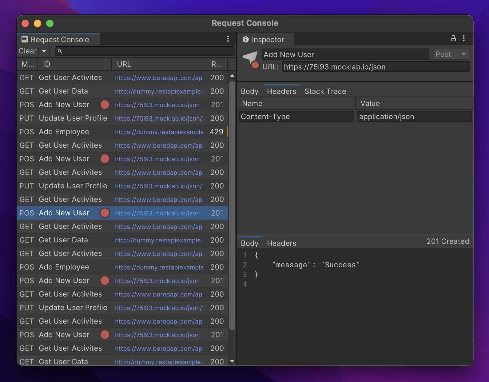

# Unity HTTP Debugger

HTTP request logging tool for Unity.
## Features
### Runtime Extensions
- Extension methods to Log web requests
- Logged requests are visible in the *Request Console Window*

### Request Console
> Open from context menu: _Http Debugger/Console_
- Log, filter, search, and preview web requests from your game/app
- Save chosen requests and responses to *Request Stash*

### Request Inspector
> Open by selecting request in Console or Stash windows
- Preview and edit your request/response
- Send requests and save responses 

### Request Stash
> Open from context menu: _Http Debugger/Stash_
- Go back to your saved requests to run and or edit them
 
### Development Priorities
- Add/polish features that can't be replaced with external apps like Postman
  - Custom and easy request logging
  - breakpoints
  - fast request/response edit/inspect
- Stash view is less important right now as Postman does it 100 times better. Development should focus on features unique to this tool.

## Dependencies
- [UI Toolkit Plus:1.9.0](https://github.com/ErnSur/UI-Toolkit-Plus)

## References
- [Insomnia](https://github.com/Kong/insomnia)
- [Fiddler](https://imgur.com/SF40wep)
- [console](https://dotnetanalysis.blogspot.com/2012/11/http-status-codes-tutorial.html)